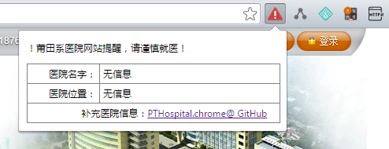

# PTHospital.chrome

一个莆田系医院网站提醒的浏览器插件，对于莆田系无良网站，将显示红色警告提示，并给出它的医院名字和所在城市。

## 安装地址

1. 下载本代码安装
2. chrome安装地址：[https://chrome.google.com/webstore/detail/%E8%8E%86%E7%94%B0%E7%B3%BB%E5%8C%BB%E9%99%A2%E7%BD%91%E7%AB%99%E6%8F%90%E9%86%92/pihadmdiehanenijehoohjnpiaofmmng](https://chrome.google.com/webstore/detail/%E8%8E%86%E7%94%B0%E7%B3%BB%E5%8C%BB%E9%99%A2%E7%BD%91%E7%AB%99%E6%8F%90%E9%86%92/pihadmdiehanenijehoohjnpiaofmmng)

## 截图

## 贡献代码

1. 首先fork代码，然后在`PTHospitalList.js`中增加医院的信息，主要是`网站`、`医院名字`、`医院位置`。
2. 然后发出PR即可。
3. 或者直接使用issue中发出issue，由我们来修改。

数据可以参考项目：

 - [https://github.com/langhua9527/Hospital](https://github.com/langhua9527/Hospital)
 - 
