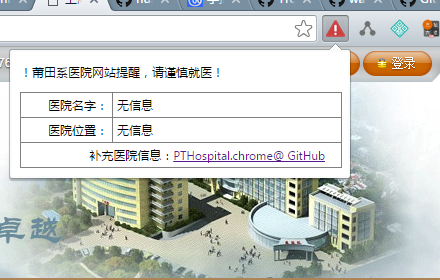
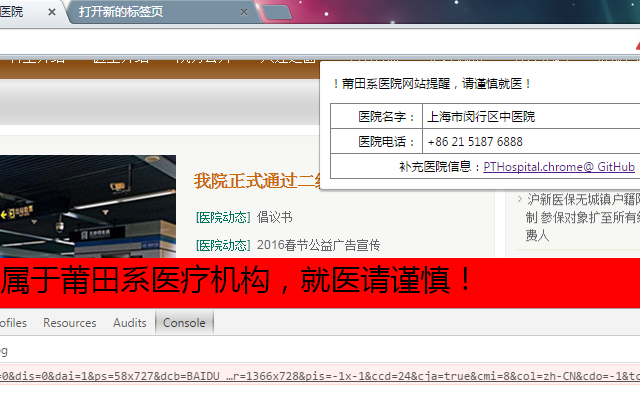

# PTHospital.chrome

医院讨论或者Github技术讨论加QQ群：**51660171**，注明Github ID加群。

本项目的意图是利用[open-power-workgroup/Hospital](https://github.com/open-power-workgroup/Hospital)收集汇总与国内一些医疗机构有关的信息，制作出来的一个`莆田系医院网站提醒`的Chrome插件，供广大寻医问药的患者及家属参考。

这是一个莆田系医院网站提醒的浏览器插件，在访问莆田系无良网站，将显示红色警告提示，并给出它的医院名字和医院电话，提醒您就医谨慎。

版本更新历史情况：[点击查看 ChangeLog](ChangeLog.md)。

## 安装方法

三种安装方法均可，推荐使用第一种，如果是墙内用户，可以使用第二、三种方法。

1. Chrome安装市场安装地址：[莆田系医院网站提醒 插件安装](https://chrome.google.com/webstore/detail/%E8%8E%86%E7%94%B0%E7%B3%BB%E5%8C%BB%E9%99%A2%E7%BD%91%E7%AB%99%E6%8F%90%E9%86%92/pihadmdiehanenijehoohjnpiaofmmng)。
2. 下载项目目录中的[PTHospital.chrome.crx](PTHospital.chrome.crx)安装，具体可以参考文章[打不开Chrome商店，怎么安装插件？](http://50vip.com/article/77)。
3. 下载本代码，将代码目录拖入到Chrome浏览器的扩展程序界面中（注意打开开发者模式）。

## 插件截图

## 贡献代码

这里的代码贡献，仅仅只是关于插件功能，插件体验，插件BUG的贡献。关于`医院数据的贡献`，不在这个项目维护，请看后面的介绍。

1. 首先fork代码；
2. 修改Chrome插件代码，并提交；
3. 最后发出PR即可。

## 提交医院数据

本插件的的所有数据都来源于：[https://github.com/open-power-workgroup/Hospital](https://github.com/open-power-workgroup/Hospital)。
对于这样的数据，我们建议统一的提交和维护更加有利，所以大家如果有相关莆田系医院信息，建议到[该项目新建Issue](https://github.com/open-power-workgroup/Hospital/issues/new)中提交莆田医院信息，请注意出示足够的信息。
